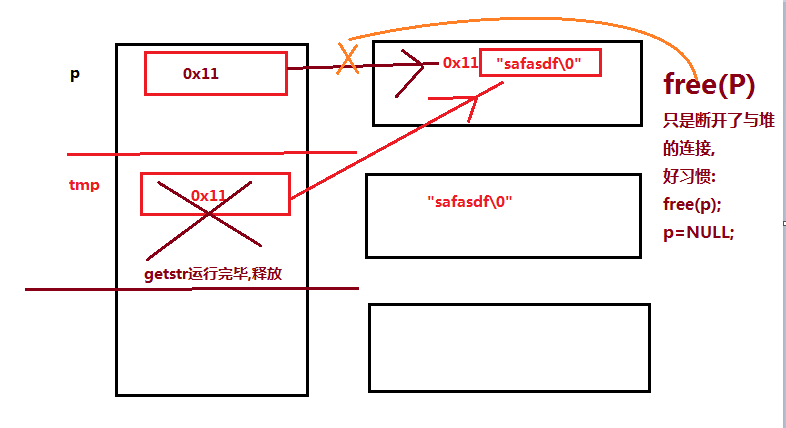

### 拓展
1. 分文件时,防止头文件重复包含:#pragma once
2. 让C代码在C++编译器编译运行  

```
#ifdef __cplusplus
extern "C"{
#endif

//函数声明

#ifdef __cplusplus
}
#endif
```
### 堆区,栈区,全局区,代码区
堆区:  malloc/new/free/delete  操作系统管理  
栈区:程序的局部变量  
全局区:常量和全局变量,操作系统管理  
代码区:操作系统管理  


## 栈区分析
```
char *get_str(){
  char str[]="asffafaf";//栈区
  return str;
}
int main(){
  char *p=NULL;
  p=get_str();
  printf("p=%s\n",p);//乱码
}
```

## 堆区分析
```
char *get_str(){
  char *tmp=(char*)malloc(100);
  if(tmp==NULL)exit(0);
  strcpy(tmp,"safasdf");
  return tmp;
}
int main(){
  char *p=NULL;
  p=get_str();
  if(p!=NULL){
      printf("p=%s\n",p);
      free(p);
      p=NULL:
  }
}
```



静态局部变量:static int a;  
定义在全局区,不随函数的释放而释放.


char str[]="abcdefghsdfdf";
字符串在文字常量区(全局),str是数组,只是拷贝了一份给数组,并无指针指向文字常量区.
***
**指针是一种数据类型**
1. 指针变量也是一种变量,占有内存空间(32位计算机占4个字节,64占8个字节),用来保存内存地址测试指针变量占有内存的大小.
2. ```*p``` 操作内存,在指针声明时,* 表示所声明的变量为指针,在指针使用时,* 表示操作指针指向内存空间的值.
