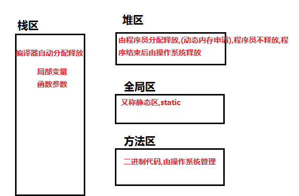
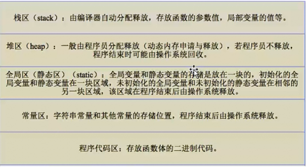
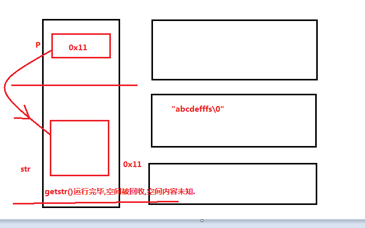
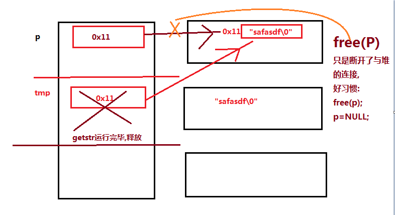

### 堆区,栈区,全局区,代码区
堆区:  malloc/new/free/delete  操作系统管理  
栈区:程序的局部变量  
全局区:常量和全局变量,操作系统管理  
代码区:操作系统管理  


## 栈区分析
```
char *get_str(){
  char str[]="asffafaf";//栈区
  return str;
}
int main(){
  char *p=NULL;
  p=get_str();
  printf("p=%s\n",p);//乱码
}
```

## 堆区分析
```
char *get_str(){
  char *tmp=(char*)malloc(100);
  if(tmp==NULL)exit(0);
  strcpy(tmp,"safasdf");
  return tmp;
}
int main(){
  char *p=NULL;
  p=get_str();
  if(p!=NULL){
      printf("p=%s\n",p);
      free(p);
      p=NULL:
  }
}
```

